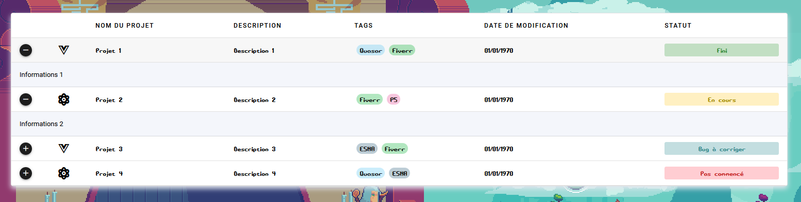
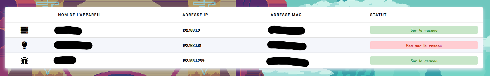
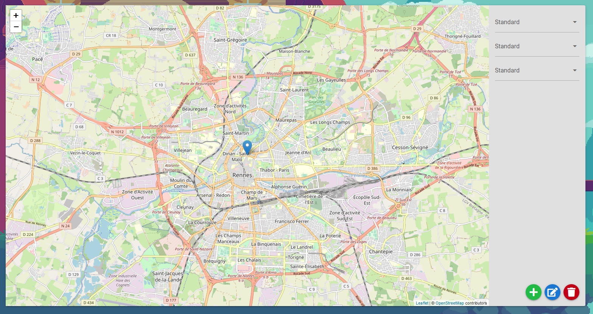
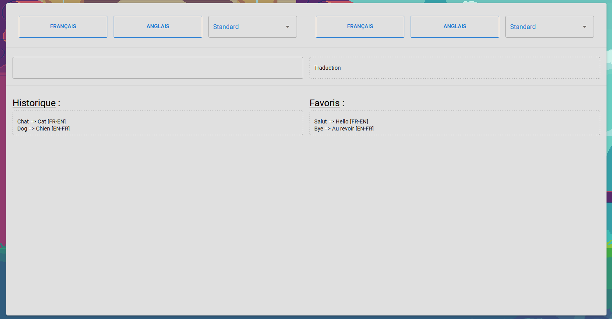
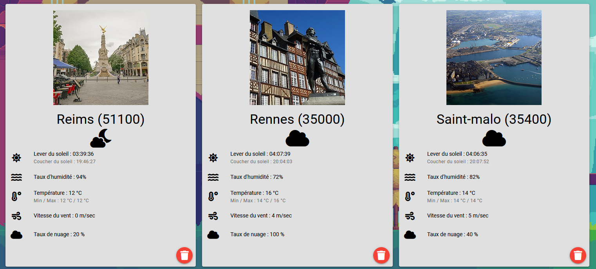
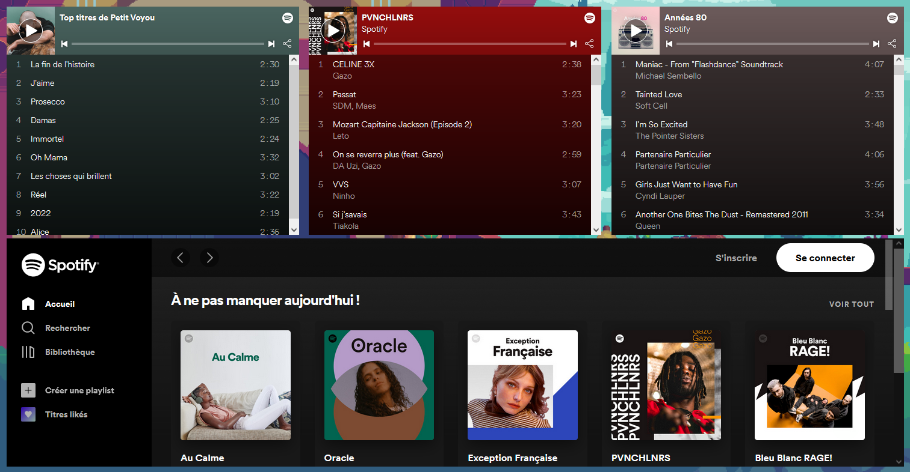
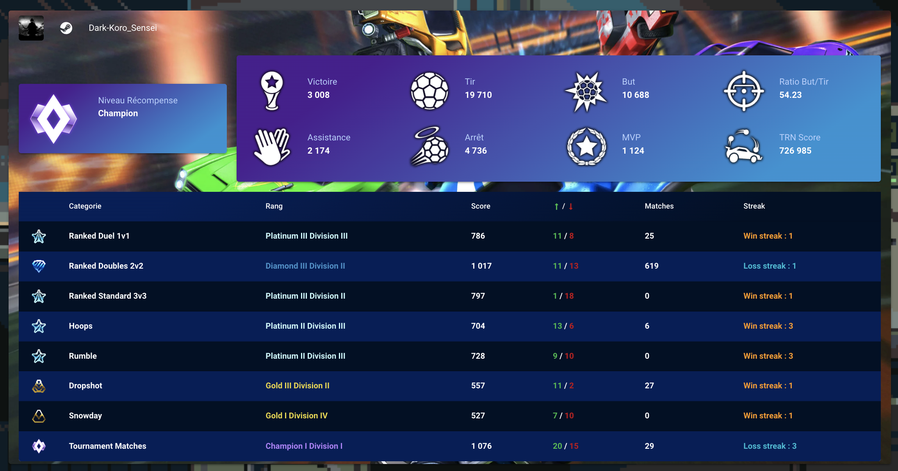
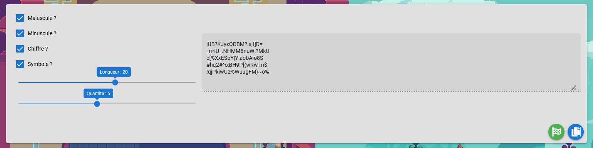
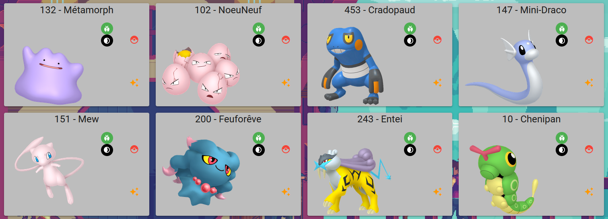
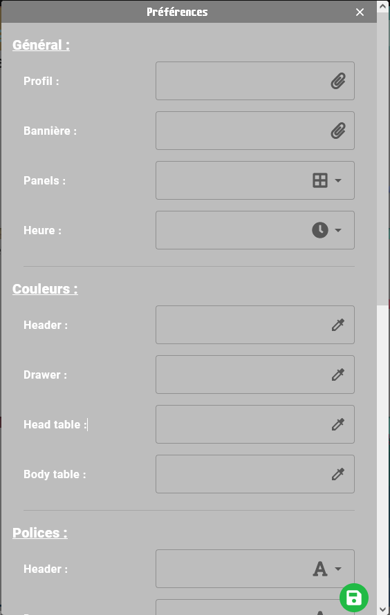

# Liokos

Bienvenue sur la page de description de mon projet d'index personnalisé. Liokos, maison en grec (Oikos) et L pour moi.

Vous y retrouverez des screenshots, des explications, une roadmap, en soit l'avancé du projet.

## ❓ Pourquoi?

Avant de rentrer dans les détails du projet, petit point sur du pourquoi du comment ce projet est né.

Un soir, j'ai voulu me faire un beau index pour mon serveur Wamp sur mon PC pour mieux présenter mes projets, à moi-même, j'avoue 😅. Et puis j'ai eu l'idée d'ajouter plusieurs choses dessus, une liste des appareils sur mon réseau, puis de gérer mes marques-pages et ensuite... C'est parti en couille 😂

Donc, dans la suite de cette présentation nous allons voir comment j'ai élaboré mon application d'un point de vue Front-end (Site Web) et d'un point de vue Back-end (API & BD)

## 🌌 Front-end
Liokos est actuellement un site web (non fini) et deviendra par la suite soit une PWA soit une application mobile.
### 🧰 Langage & Framework
Pour la réalisation du Front j'ai utilisé le framework Quasar. Quasar est un fork de VueJS important d'autre choses très intéressantes. Ce framework est fais en JavaScript, lors de la conception de l'application le code se décompose en, au moins, deux parties. La vue qui sera notre code HTML (avec les attributs Vue) et le script qui sera du JavaScript, il est possible aussi d'utiliser du TypeScript si besoin.
L'utilisation du framework Quasar n'impose en réalité pas beaucoup de chose, en tous cas rien de dictatorial. Au contraire, il est possible de tout configurer, même le style de certain élément peuvent être réécrit si besoin (**QUE SI NÉCESSAIRE**). 
### 👨‍🦱 Utilisateur
Lors d'une utilisation classique de l'application, l'utilisateur rentre ses identifiants sur la page de connexion. Il arrive sur son premier panel (on y reviendra après) englober par le layout principale.
Le layout principale est composé d'une bar (un header) style MacOs (Plus jolie et pratique), d'un drawer (Scroll) à gauche, d'un footer et enfin du conteneur principale.
	- La bar se compose de plusieurs informations et boutons. Un logo de téléphone qui cache un menu, ce menu est composé des numéros d'appel d'urgence français, avec un lien directement pour l'application téléphone. À côté du logo se trouve le nom du panels sur le quel on se trouve. Au bout de la bar on retrouve l'heure et la data actuelle. Enfin un bouton pour fermer le menu droit.
	- Le menu droit est une liste scrollable pour l'affichage des favoris ainsi que des paramètres. En haut du menu on retrouve le nom de l'utilisateur ainsi que son image et sa bannière. Le menu est tout d'abord composé de catégories de marque-page, en haut on retrouve les favoris (ce qui sont utilisé le plus) avec un simple scroll à gauche ou à droite on peux éditer ou supprimer le marque-page. Après les catégories on retrouve le bouton de paramètres, l'accès au panel d'admin (si l'utilisateur à le droit) et un bouton de resynchronisation si besoin.
	- Le footer permet de changer de panel facilement reconnaissable avec un nom et une icône (seulement une icône sur un écran petit). Lors de la selection d'un panel il saute pour montrer le changement. Sur mobile l'application change un peu et propose seulement un bouton en bas de page qui affiche un Bottom Sheet.
	- Le conteneur principale se change lors de la sélection d'un panels il fait toujours la même taille et n'est pas très intéressant en soit.
 
### 👨‍💻 Admin
Description du panel d'admin

### 👀 Panels
Voici une description des panels, panneaux, qu'on peut retrouver sur l'application. Ce sont des panels que j'ai imaginer moi-même cependant il ne sont pas forcement utile pour tout les utilisateurs c'est pour ça qu'ils sont paramétrables.

#### Projets

Le panneau projet, comme sont nom l'indique il permet la centralisation des projets réalisé. Il est constitué d'une table avec pour chaque ligne (chaque projet), une icône, un nom de projet, une description, un ou des tags, une date de création et un statut. Cette table se modifie selon la taille d'affichage de l'écran, elle se transforme en grid.
(photo table)
(photo grid)

#### Appareils

Le panneau appareils est une table (ou grid pour petit écrans) qui liste les appareils sont le réseau sur lequel est installé l'application. Pour chaque ligne, chaque appareil, du tableau il y a une icône, un nom, une adresse ip, adresse mac et son statut. Tous les appareils recenser au moins une fois sont enregistré et affiché en tant que "non connecté".

#### Carte

Le panneau carte est une carte basé sur OpenStreetMap grâce à Leaflet. Cette carte permet de référencer l'ensemble des activités et lieux fait par l'utilisateur. Il peut noter cette activité, mettre une description à celle-ci. Il peut également noté une activité ou lieux qu'il aimerait faire, un pense-bête. Lorsque l'utilisateur veut aller sur une activité le trajet s'affiche dans Waze ou google Maps

#### Traduction

Le panneau traduction se repose sur l'API Google traduction. L'utilisateur peux paramètre deux langues sources et deux langues destination favorites sinon il peut sélectionner dans une liste. Comme pour google traduction l'utilisateur saisie son texte et le vois s'afficher de l'autre côté. Un historique est réalisé à chaque entrée et l'utilisateur peut choisir de mettre en favoris une traduction afin de pas l'oublier.

#### Actualités
La panneau actualités est un carrousel avec les actualité correspondant à des mots-clés rentrée par l'utilisateur.

#### Inventaire
Le panneau inventaire est un inventaire des produits dans la maison. C'est un tableau référençant les produits actuel dans le garde-manger. Prenons un cas classique, l'utilisateur fais ses courses, il rentre chez lui, avant de mettre ses yaourts au frigo il scanne le code barre, grâce à l'API Yuka l'application connait donc le produit et les caractéristiques du produit. Pour chaque ligne du tableau il y a donc le nom du produit, son score et ses caractéristiques. Lors de l'ajout dans le table l'utilisateur peut donner une quantité. Lorsque les yaourts sont finit l'utilisateur peut alors supprimer l'element du tableau. Il est envisagé d'envoyé une notification aux utilisateurs pour leur prévenir qu'il n'y a plus de yaourt. Il est égalment envisagé de proposer d'ajouter les yaourt finis à une liste de courses

#### Météo

Le panneau météo est une grid de card météo. L'utilisateur peux choisir qu'elle météo il souhaite sur sa page. Une card météo est composé d'une photo (Wikipedia) de la ville, le nom, le code postal, et des informations de la ville (temps, heure du soleil, humidité, ...) Chaque carte représente un module ce qui fais que l'utilisateur peut en ajouter ou en supprimer à sa guise ça ne changera en rien l'utilisation des autres utilisateurs

#### Spotify

Le panneau Spotify est un panneau comportant les playlists préférer de l'utilisateur, il peut changer ses favoris quand il le souhaite

#### Rocket League

Le panneau Rocket League est un tableau avec toutes les stats du joueur, joueur paramétrable. On retrouve les stats globales ainsi que les stats de la saison.

#### Générateur de mot de passe

Le panneau GenMDP est comme son nom l'indique un générateur de mot de passe. Il est possible de choisir la longueur et la quantité de génération. Un bouton de copie permet de directement mettre dans son presse-papier le mot de passe.

#### Calendrier
Le panneau Calendrier est comme son nom l'inqiue un calendrier. Le calendrier est formé de plusieurs liste d'évent. Chaque liste correspond à un thème (Les anniversaire, les cours, les réunion, ...) Il est possible d'ajouter, modifier ou supprimer une liste pareil pour les events dedans. L'utilisateur peut également choisir de partagé sa liste aux autres utilisateurs de l'application. L'utilisateur peut cacher ou afficher une liste si besoin.

#### Statistiques pas
Le panneau StatPas est un tableau référençant le nombre de pas fait par l'utilisateur. Chaque soir à 20H une notification lui est envoyé pour pas oublier d'enregistrer ses pas. Il est possible de les ajouter à la main par la suite. Des stats sont à prévoir

#### Suivi de colis
Le panneau Colis est un stepper avec les étapes d'un numéro de colis demandé. L'utilisateur peut suivre la progression de son colis comme il le souhaite. Un tableau est également affiché pour que l'utilisateur puisse sélectionné, ajouter ou supprimer un colis (ATTENTION aux différents expéditeur)

#### Position
Le panneau Position est un panneau qui reste d'être inutile pour beaucoup. Il sert à convertir des données de position. Dans mon cas c'est utile lorsque je fais du GeoCache.

#### Pokemon

Le panneau Pokemon est un Pokedex en soit. C'est une grid de carte pokemon avec son nom, son numéro, sa photo, et la possibilité de dire si le pokemon est capturé ou si on l'a en shiny. Il est possible aussi de trier les cards afficher pour n'affichant que les pokemon non capturé par exemple. Etant joueur de Pokemon GO, je trouve ça utile.

#### ResetGame
Le panneau ResetGame est un panneau de paramètre pour un truc utile pour les joueurs mobile, le reset. Un reset dans un jeu est lorsque le jeu passe minuit le joueur reçoit une récompense ou de nouvelles quêtes, etc .. Cependant tout les jeux n'utilise pas les même fuseaux horaire ou même ne place pas le reset à minuit. En plus de ça tout les jeux n'envoie pas de notif donc palier au problème vous pouvez rentrer le nom du jeu, une icone et l'heure du reset et vous recevrez une notifications push.

#### Paramètres

Le panneau Paramètre est une liste d'élement paramètrable dans l'application BoHome. Vous pouvez changer votre image de profil, de bannière, La liste des panels que vous voulez, l'affichage de l'heure, la couleur des tables, la police des tables, et les différents changement au niveau des APIS, un skin de carte, une préférence traduction, les mot clés de l'actualité, vos villes pour la météo, votre playlist spotify, votre nom Rocket League, votre heure de préférence pour les pas.
 
 
##  🔌 Back-end
Le back-end servant l'application est une API REST permettant de faire le lien facilement entre le front-end et la base de données
### 🧰 Langage & Framework
Pour le Back-end j'ai choisi d'utiliser du Javascript (Encore 😬) avec un serveur NodeJS en utilisant le framework KoaJs. C'est un framework très léger, bon tellement léger que pour la moindre petites choses on doit installer un module à chaque fois, mais pour ce projet ce ne fut pas trop compliqué. Ce framework permet la création d'api. J'ai utilisé le module knex pour la connexion et la création de base de donnée.
### 🐬 BD
Pour la création de la BD, en utilisant Knex on peux créer des migrations pour éditer les tables et des seeds pour la remplir. De plus, on peut créer des queries permettant d'intéragir avec la base de donnée, c'est une manière plus simple que d'écrire des requêtes SQL et d'éviter tout un tas de problème lier à l'écriture de requête maison. Ma base de données est une base MySQL, cependant il est possible de mettre en place une BD PostgreSQL ou autre.
### ✅Test
J'ai fais un ensemble de test unitaire durant l'écriture de mon API ainsi je peut savoir si une requête répond bien ou non selon ce qu'on lui envoie. L'écriture de ses tests on été fais avec jest, un module node.
### 📚 Swagger
Afin de m'y retrouver un peu plus dans cette jungle de route, j'ai mis en place une documentation fait avec Swagger. Cette documentation est la liste des routes de l'API avec leur paramètre si besoin. On peux également voir si une requête à besoin d'une authentification ou non.

## 🚀 Roadmap
- **Arreter de rajouter des idées**
- Terminer l'écriture des vues
- **Arreter de rajouter des idées**
- Vérification de la responsivité de l'application
- **Arreter de rajouter des idées**
- Vérification de la portabilité en PWA ou APK
- Mettre en place les notifications push
- Héberger l'application
